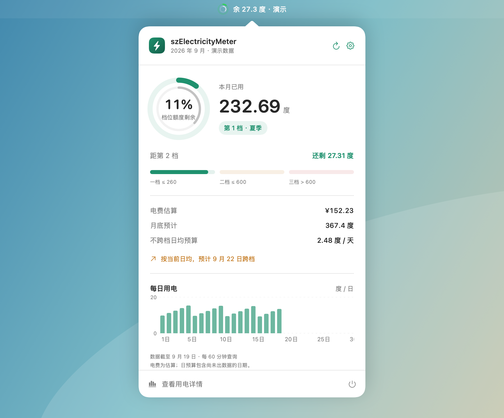
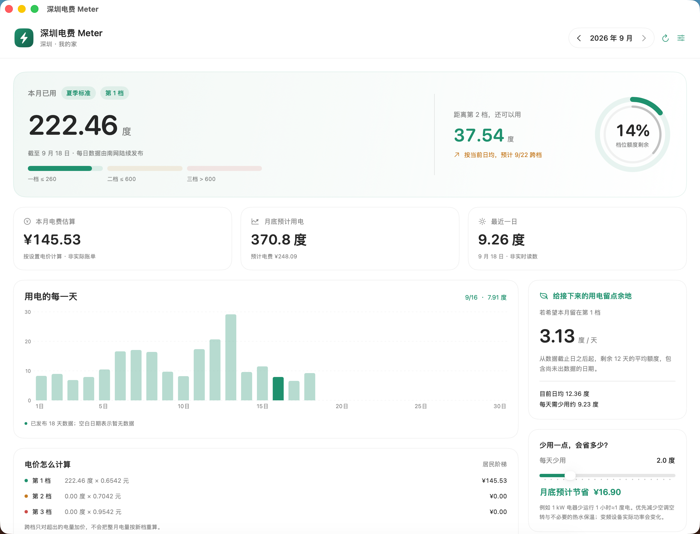
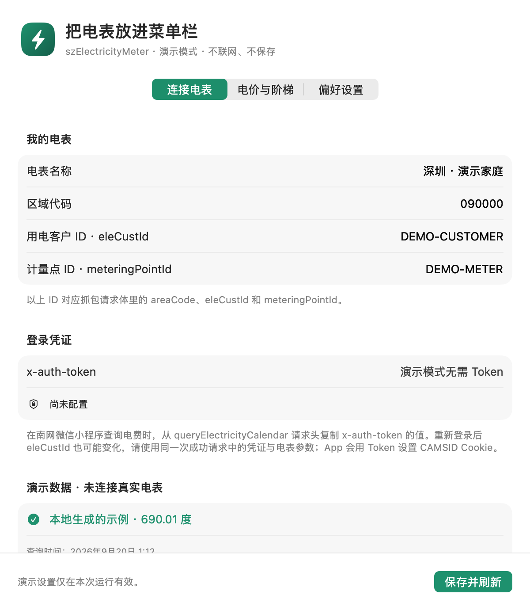
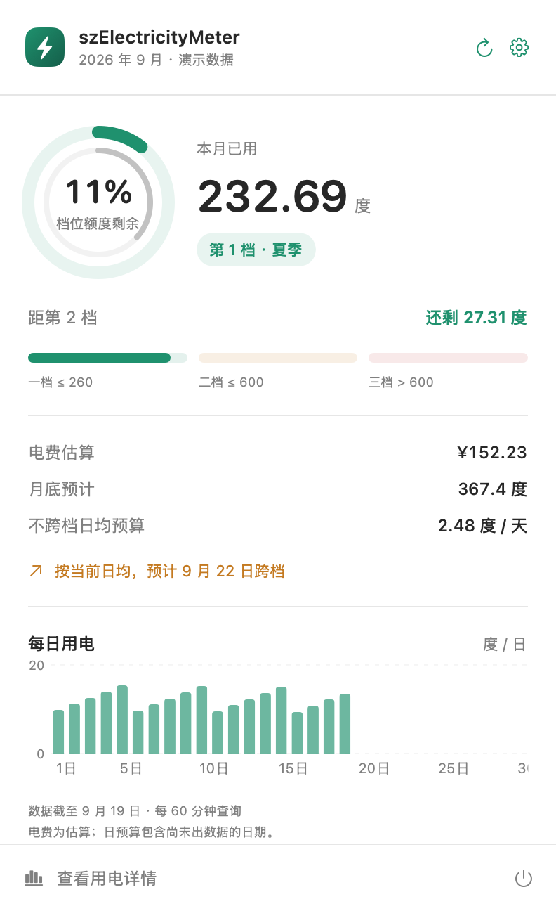
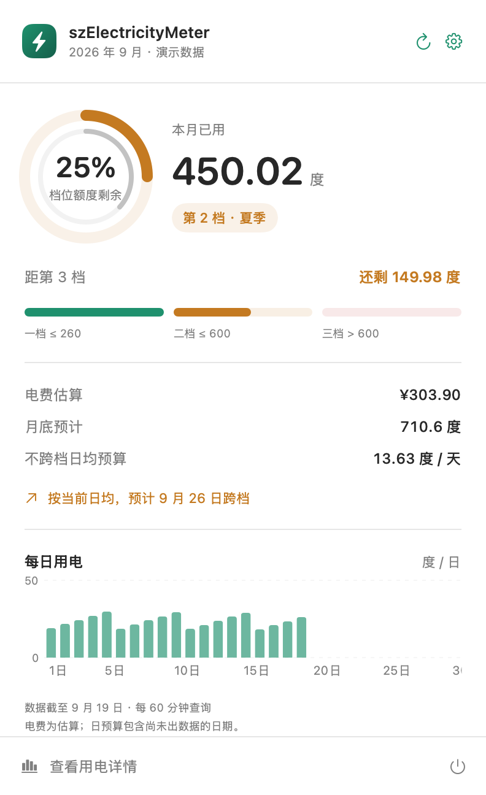
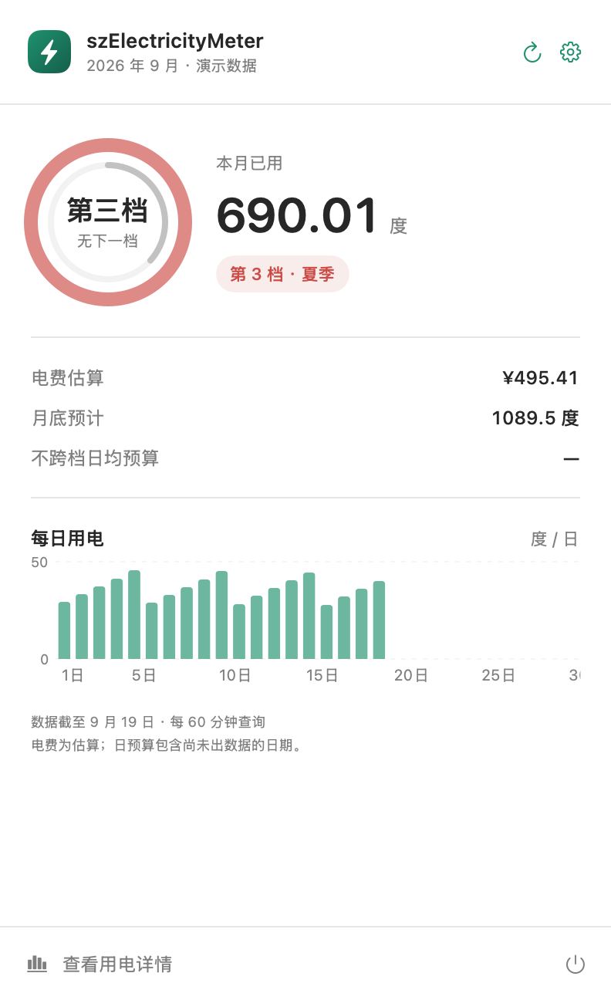
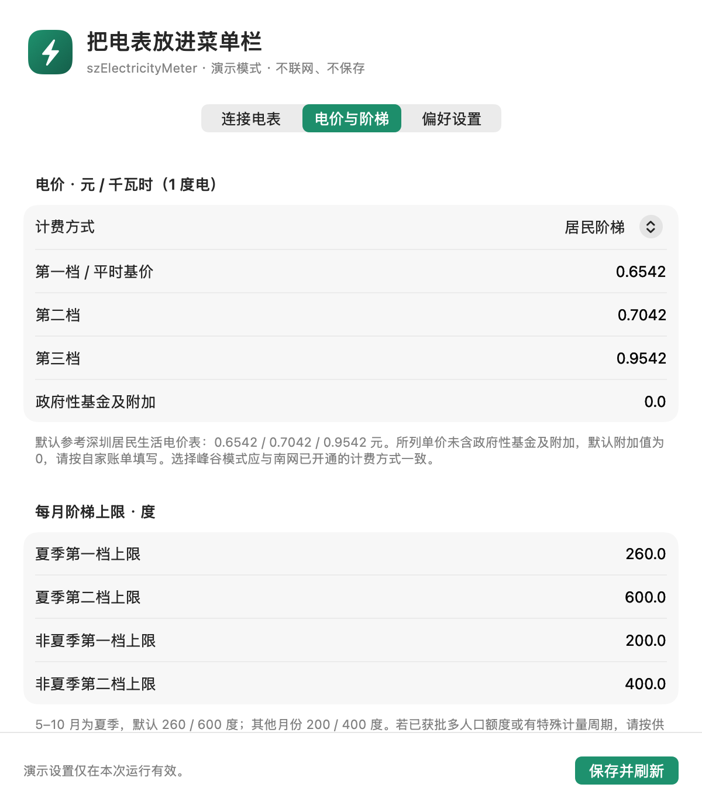
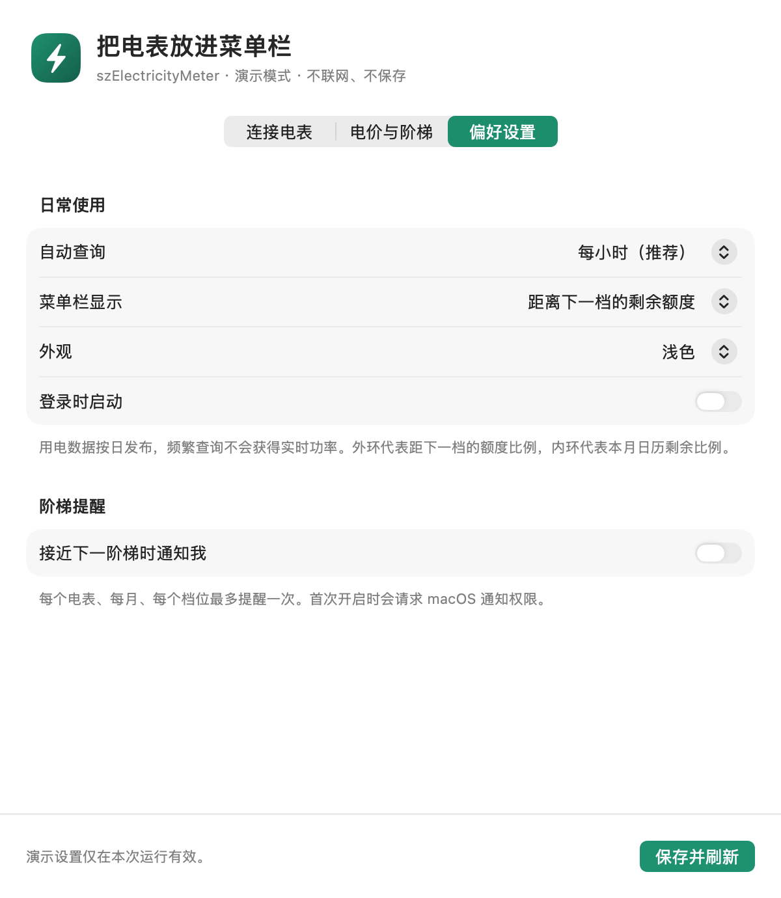

# szElectricityMeter

**深圳电量表 · 把距离下一阶梯的电量，放进 Mac 菜单栏。**

原生 macOS 用电工具。查看月累计、阶梯余量、日用电趋势和节电预算，少一点月底账单的意外。

SwiftUI · AppKit · Swift Charts · macOS 14+ · 无第三方运行依赖 · MIT




菜单栏场景使用 App 的实际圆环与浮窗组件，搭配演示渐变背景；数值均为虚构数据。

> 用电详情全景由作者提供，其余截图使用离线演示数据。图片中的电量仅作界面示例。本项目是独立社区工具，与中国南方电网及其关联方无隶属、合作或官方授权关系。电费与预测用于辅助估算，以供电账单为准。

## 它能做什么

- **菜单栏彩色双环**：一档绿、二档橙、三档红，随时查看距离下一档的剩余电量。
- **阶梯预算**：本月还可以用多少度、按当前日均何时跨档、每天控制到多少度。
- **每日趋势**：按月查看用电柱状图，悬停读数，支持历史月份与本机缓存。
- **节电模拟**：拖动“每天少用”滑块，估算到月底可能减少的支出。
- **电价可调**：居民阶梯、峰谷、合表三种模式；夏季与非夏季额度分别设置。
- **本机保存**：Token 放在 macOS 钥匙串，户号参数可编辑，无账号注册、云端中转或遥测。
- **日常使用**：默认每小时刷新，可选阶梯通知、登录启动、深浅色与菜单栏显示方式。

电量按日发布，并非实时功率监测。缺失、延迟或不完整的数据会明确提示，不用零度填补未发布日期。

## 先体验，再连接

需要 macOS 14 或更新版本，以及 Apple Command Line Tools（`xcode-select --install`）或 Xcode；Swift 5.9+。

下载本仓库源码 ZIP 并解压，在项目目录运行：

```sh
./Scripts/test.sh
./Scripts/build.sh
open dist/szElectricityMeter.app --args --demo --show
```

`--demo` 使用虚构电表与用电数据，不读取本机账号、Token 或用电缓存，不联网、不保存设置，也不会启用登录项或通知。详情页顶部可切换第一、第二、第三档，观察不同颜色与预算状态。退出演示 App 后，去掉 `--demo` 重新打开即可连接自己的电表。

构建当前 Mac 架构的安装包：

```sh
./Scripts/package.sh
```

产物位于 `dist/`：App、按版本与架构命名的 DMG、SHA-256 校验文件。将 App 拖入“应用程序”即可本地安装。当前已在 Apple Silicon Mac 验证；Intel 构建与运行尚未验证。构建产物使用 ad-hoc 本地签名，未做 Apple Developer ID 签名或公证；下载分发版可能被 Gatekeeper 拦截，开发者可优先审阅源码后自行构建。

目前不提供官方签名、自动更新或跨平台版本。

## 连接自己的电表

1. 使用自己有权访问的南网账号，在小程序查询月度用电。
2. 从**同一次成功请求**中取得 `x-auth-token`、`areaCode`、`eleCustId`、`meteringPointId`。
3. 打开 App 设置 → **连接电表**，填入上述字段，点击 **保存并刷新**。
4. 确认“连接验证”显示查询成功；仅保存凭证不代表连接成功。

具体操作见 [Charles 抓包与配置指引](docs/charles-guide.md)。如果只想看界面，不需要抓包，使用演示模式即可。

**重新登录后，`eleCustId` 也可能变化，即使 Token 没变。** 遇到“请确认绑定 id 是否正确”时，请一起核对电表参数，不要只更换 Token。`yearMonth` 由 App 根据选择的月份自动生成，无需填写。Token 留空会保留现有值，不会回显；失效后需手动更新。



## 页面预览


| 第一档 · 绿色 | 第二档 · 橙色 | 第三档 · 红色 |
| --- | --- | --- |
|  |  |  |

摘要截图使用演示窗口展示相同的菜单栏内容。第三档已没有下一档额度，红色外环表示最高阶梯状态，不再表示剩余百分比；节电仍能减少支出。





[查看更多截图，包括详情下半页、历史月份与深色外观](docs/screenshots.md)。

## 如何理解电费

跨档只对超出部分加价，前面已用的电量不会全部改按更贵的价格计算。App 中的档位表示下一度电适用的档位；恰好达到第一档上限时，会进入第二档。

默认普通阶梯电价为 `0.6542 / 0.7042 / 0.9542` 元/度，夏季 5–10 月为 `260 / 600` 度，其他月份为 `200 / 400` 度。这些单价未计政府性基金及附加，应按自家账单校准。[深圳市发展改革委价目表](https://fgw.sz.gov.cn/attachment/1/1460/1460239/11394935.pdf)

当前按自然月估算，不自动识别特殊抄表周期、多人口优惠、免费电量和账单舍入规则。完整公式、峰谷数据条件与预测限制见 [计算口径](docs/calculation.md)。

## 隐私与接口边界

- 只向 `weixin.csg.cn` 的电量查询接口发送你配置的凭证与电表参数；不经过开发者服务器。
- Token 保存到系统钥匙串；电表参数和最近 24 个月的规范化用电缓存存于本机。电表 ID 与用电数据也属于需要保护的信息。
- 不记录 Token，不保留原始响应中的表号和设备编号。请求拒绝重定向，不向其他域转发凭证。
- 该接口来自对小程序请求的观察，并非本项目获授权的公共开放 API。未确认服务方允许第三方客户端接入；接口可能变化、失效或限制访问。
- 使用自己的账户不自动等于获得接口集成或公开分发授权。请核对当前用户协议和适用要求；开源许可证只授予本项目代码的权利，不授予南网接口、数据或品牌的权利。

更多存储位置、清理方式与问题反馈规则见 [隐私说明](docs/privacy.md) 和 [安全政策](SECURITY.md)。

## 常见问题

**Token 保存了却查不到？** 先看连接验证区。未登录通常需更新 Token；绑定 ID 错误则应重新复制同一次成功请求里的电表参数。接口变化或网络错误也可能造成失败。

**为什么有电量，却没有月底预测？** 至少需要从月初连续的 3 天日数据，合计需与月累计匹配，且数据不能落后超过两天；历史月不做预测。

**为什么峰谷模式没有金额？** 只有峰、平、谷电量完整且总和匹配月累计时才能计算。普通阶梯用户单纯错峰不会改变每度单价。

**为什么点关闭后 App 还在？** 这是菜单栏 App，不显示 Dock 图标。右键菜单栏图标可退出；`⌘,` 打开设置。

**改名后旧配置还能用吗？** 可以。为兼容早期本地版本，bundle ID、钥匙串服务和本地数据目录保持原命名；产品、源码目录和构建产物已改为 `szElectricityMeter`。升级前先退出旧版，避免同时运行两份。

## 参与开发

核心计算与解析在 `Sources/MeterCore`；原生界面、网络与存储在 `Sources/szElectricityMeter`。测试位于 `Tests/MeterCoreTests`，通过独立断言运行器执行，不依赖 XCTest。

欢迎修复问题、改进文档和提交功能建议。请先阅读 [贡献指南](CONTRIBUTING.md)。不要在 Issue、PR、截图或日志中上传 Token、Cookie、真实户号或完整抓包文件。

## 请我喝杯咖啡

如果这个小工具对你有帮助，欢迎自愿赞助。**所有功能免费，赞助不解锁功能、不换取查询服务，也不承诺维护时限。** 不赞助同样可以完整使用。

<details>
<summary>展开微信赞赏码</summary>


</details>

## 许可与灵感

源码采用 [MIT License](LICENSE)。第三方名称、商标与服务权利归其各自权利人所有。
