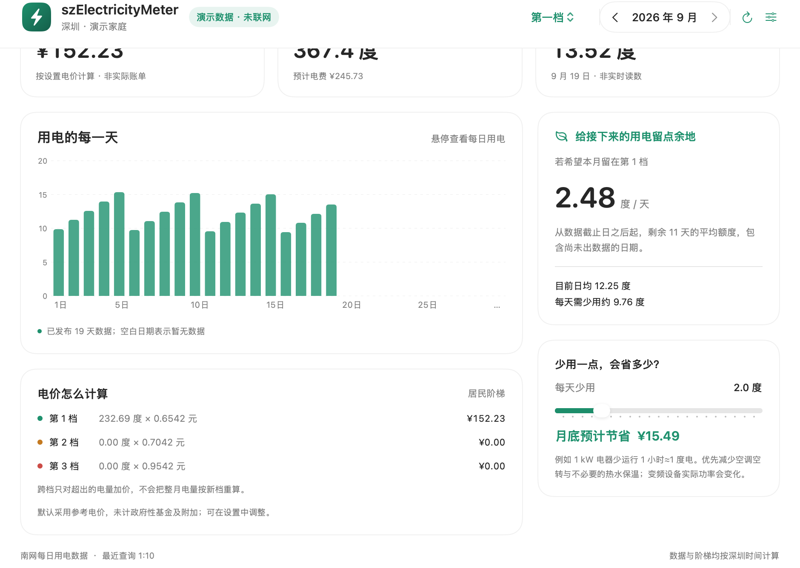
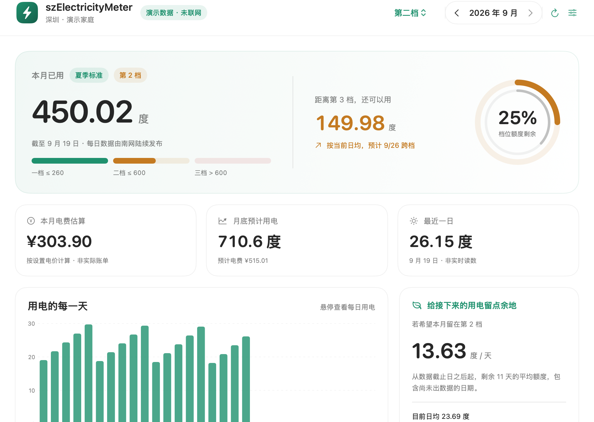
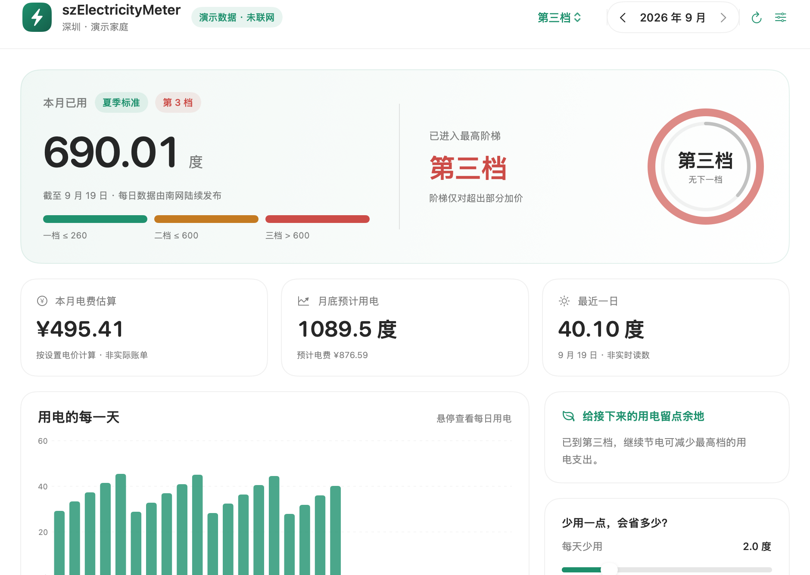
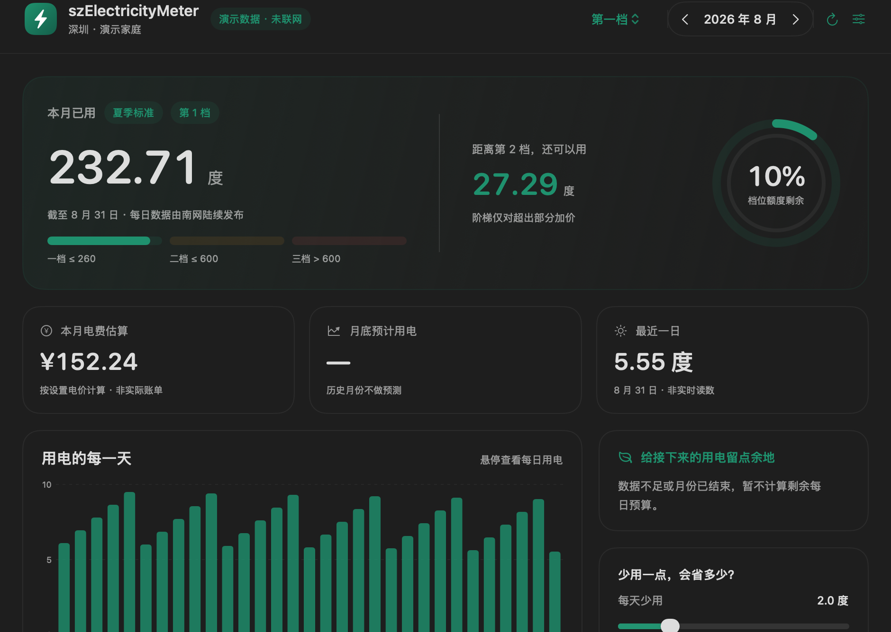
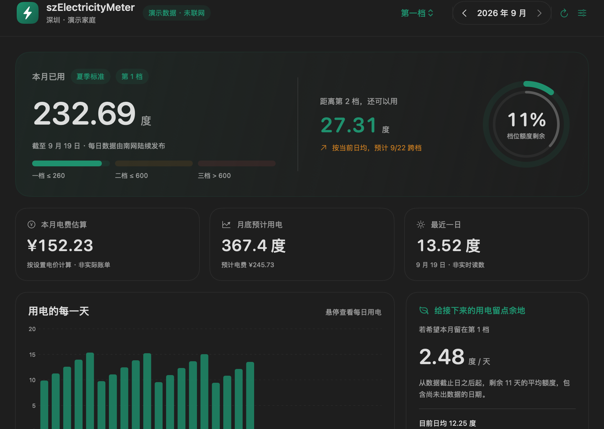
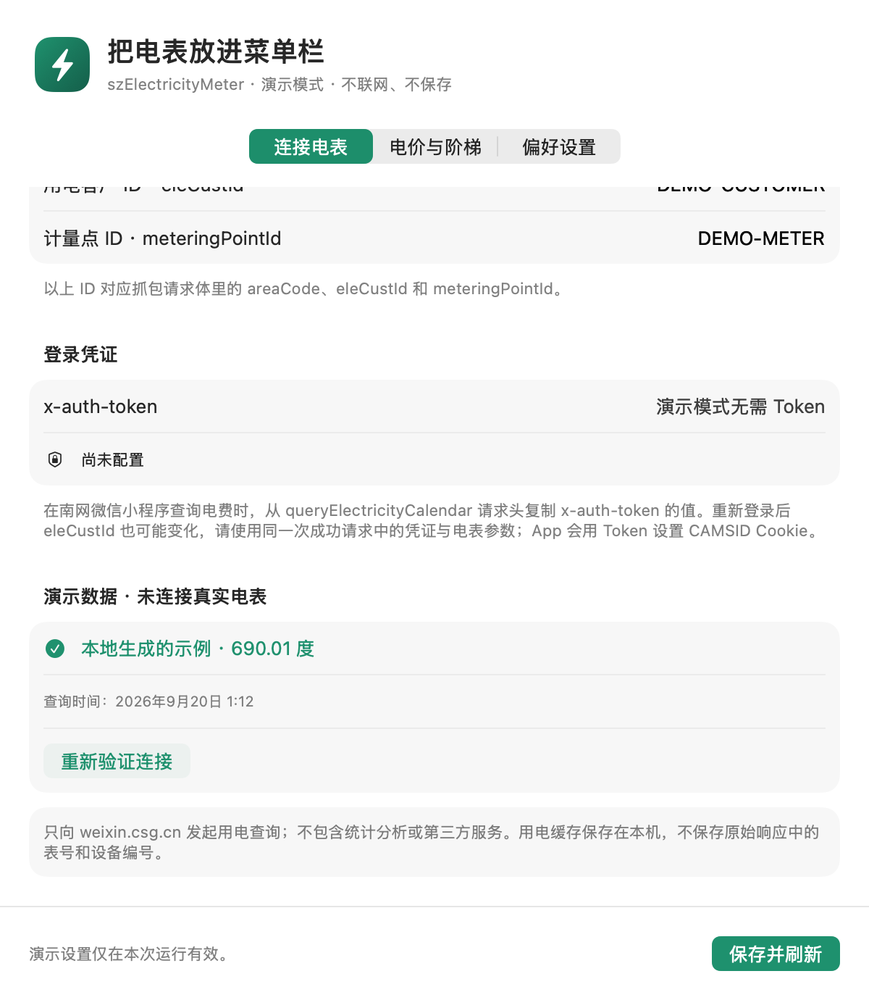
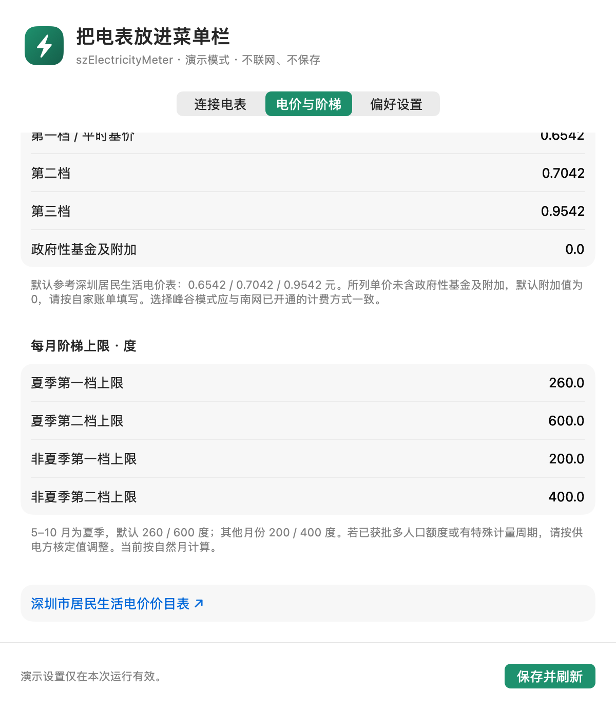

# 页面截图

第一档用电详情全景由作者提供，保留完整窗口。其余图片为 App 原生窗口内容导出的 2× 无损 PNG，使用 `--demo` 生成的虚构数据。图片中的电量仅作界面示例，不同截图的数值和日期可能不同。演示无需 Token，不读取真实电表，日期随生成时的月份变化。摘要使用与菜单栏浮窗相同的原生视图，在演示窗口中采集；演示模式按 `⌘⇧M` 可打开该窗口。

作者提供的详情全景为 2512 × 1918 像素；其余详情页为 1880 × 1336，摘要为 792 × 1296，设置为 1200 × 1380，菜单栏完整场景为 1760 × 1460。点击图片可查看原图。

## 菜单栏完整场景

顶部彩色圆环与展开摘要使用 App 的实际绘制组件，背景为演示渐变。此图用于展示菜单栏与浮窗的关系，不是系统桌面的实拍截图。

## 第一档 · 绿色

## 第二档 · 橙色

## 第三档 · 红色

## 历史月份

## 深色外观

## 设置

[返回首页](../README.md)
